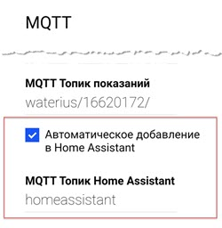
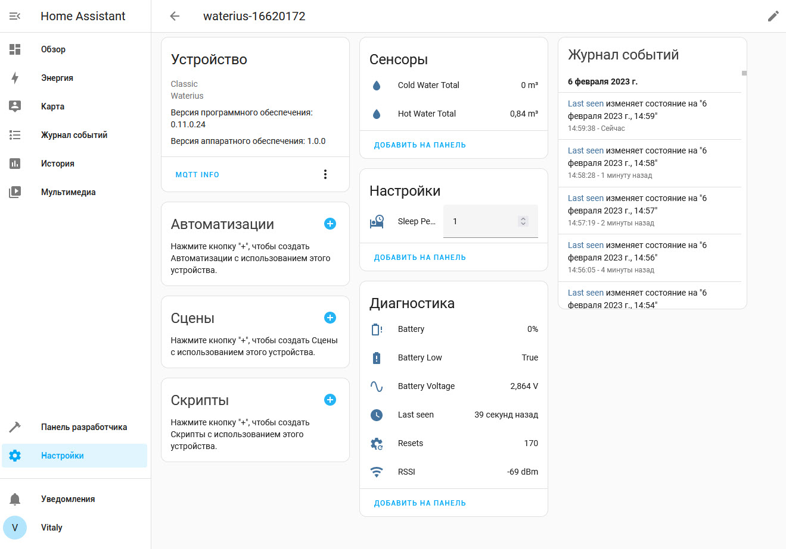
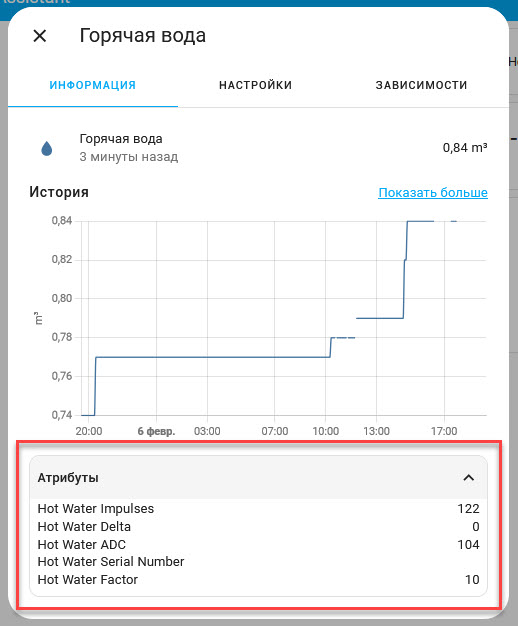
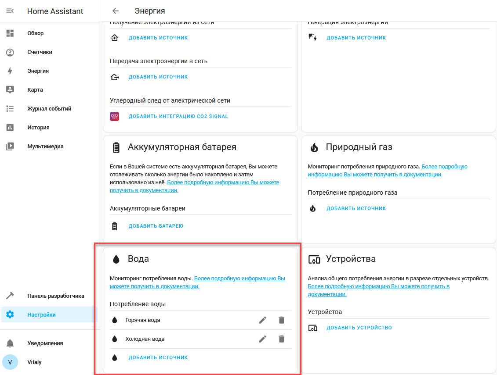
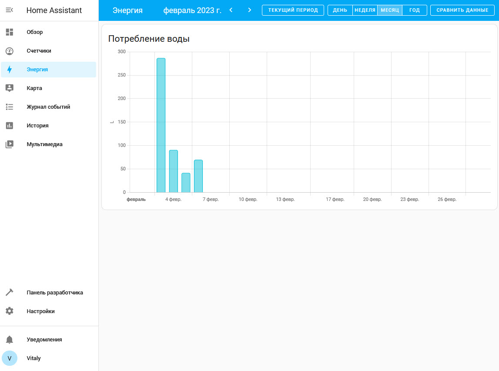
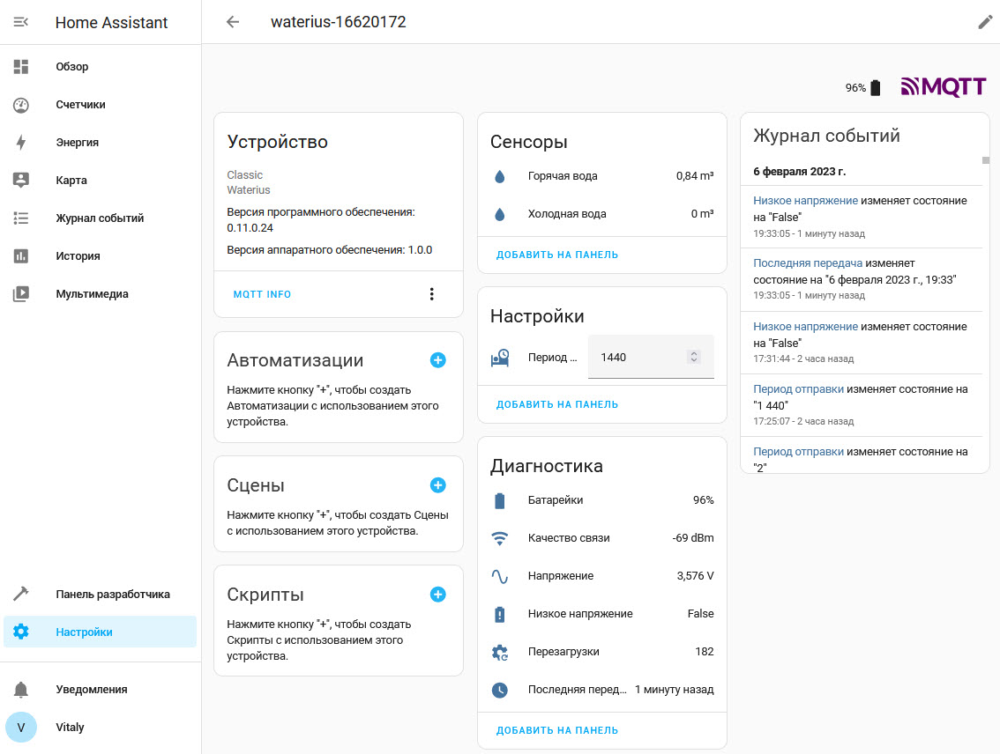

# Настройка интеграции c Home Assistant

Возможна настройка интеграции Ватериуса с Home Assistant в двух режимах:

- [автоматический (с 0.11.0)](#автоматическая-настройка)
- [ручной](#ручная-настройка)

**Важно!** Для обеих режимов необходима настроенная интеграция Home Assistant c [брокером MQTT](https://www.home-assistant.io/integrations/mqtt/).

## Настройки Ватериуса

Для обеих режимов необходимо, чтобы были заполнены следующие настройки в Ватериусе:
1. Указан ip адрес MQTT брокера или имя сайта
2. Указан port MQTT брокера
3. Указан топик, по которому будут отправлены данные (Topic). Топик должен быть уникальным.

Эти настройки отображаются при выделенном чекбоксе "доп. настройки".


## Автоматическая настройка

Для включения автоматической настройки интеграции с Home Assistant при настройке ватериуса отметьте пункт "АВтоматическое добавление в Home Assistant"



После завершения настройки и отправки первых показаний в интерфейсе Home Assistant появится новое утсройство.



Для сенсоров показаний (холодная, горячая) и RSSI доступны дополнительные атрибуты, которые можно увидеть щелкнув на выбранный сенсор



После появления устройства и его показателей можно настроить панель "Энергия" для автоматического посчета расходов.

Добавьте в свойствах панели "Энергия" показания расхода воды



После этого отчеты станут доступны в панели.



_Статистика может отражаться не сразу, а по прошествии некотрого времени._

### Перевод названий на русский

Для того чтобы автоматически добавить переводы ко всем показателям можно воспользоваться [настройкой](https://www.home-assistant.io/docs/configuration/customizing-devices/#customizing-entities). Для этого в конфигурационный файл `configuration.yaml` добавьте следующу секцию:

```yaml
homeassistant:
  customize_glob:
    "sensor.waterius_*_ch0":
      friendly_name: "Горячая вода"
    "sensor.waterius_*_ch1":
      friendly_name: "Холодная вода"
    "sensor.waterius_*_voltage_low":
      friendly_name: "Низкое напряжение"
    "sensor.waterius_*_battery":
      friendly_name: "Батарейки"
    "sensor.waterius_*_voltage":
      friendly_name: "Напряжение"
    "sensor.waterius_*_timestamp":
      friendly_name: Последняя передача
    "sensor.waterius_*_resets":
      friendly_name: "Перезагрузки"
    "sensor.waterius_*_rssi":
      friendly_name: "Качество связи"
    "number.waterius_*_period_min":
      friendly_name: "Период отправки"
```

После перезагрузки Home Assistant свойства устройства будут выглядеть следующим образом



## Ручная настройка

Предполагается, что у вас уже установлен MQTT брокер, а также соответствующая интеграция для Home Assistant.

[Видео инструкция](https://www.youtube.com/watch?v=50J8hMOy7Dc)

### Создание сенсоров

Со списком доступных параметров, а также их описанием можно ознакомиться по [ссылке](https://github.com/dontsovcmc/waterius/blob/master/Export.md)

Также параметры и их текущие значения можно посмотреть при помощи [MQTT Explorer](http://mqtt-explorer.com/)

Ознакомьтесь с примером файла конфигурации [configuration.yaml](homeassistant.configuration.yaml)

Обратите внимание, что название сенсора

```yaml
states.sensor.kholodnaia_voda.last_updated
```

у вас может отличаться, всё зависит от того как вы назвали сенсор слушающий топик расхода холодной воды *ch1*

## Создание автоматизаций

Приведённые ниже автоматизации отправляют уведомления в телеграмм о низком напряжении питания Ватериус, а также в случае если устройство не выходило на связь более 27 часов (100 000 сек)

#### Низкое напряжение на Ватериус

**NB:** Значение сенсора в entity_id может отличаться от указанного в примере, в случае если вы вносили изменения в название сенсоров.

```yaml
- alias: Ватериус низкое напряжение
  trigger:
  - platform: state
    entity_id: sensor.napriazhenie_pitaniia_vateriusa
    to: Низкое напряжение
  action:
  - service: notify.telega
    data:
      message: Внимание! На ватериус зафиксированно низкое напряжение
  mode: single
```

#### Ватериус не выходил на связь более 27 часов

**NB:** Значение сенсора в entity_id может отличаться от указанного в примере, в случае если вы вносили изменения в название сенсоров.

```yaml
- alias: Ватериус вне сети более 27 часов
  trigger:
  - platform: state
    entity_id: sensor.vaterius_last_seen
    to: '100000'
  action:
  - service: notify.telega
    data:
      message: Внимание! Ватериус вне сети более 27 часов.
  mode: single
```
