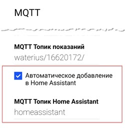
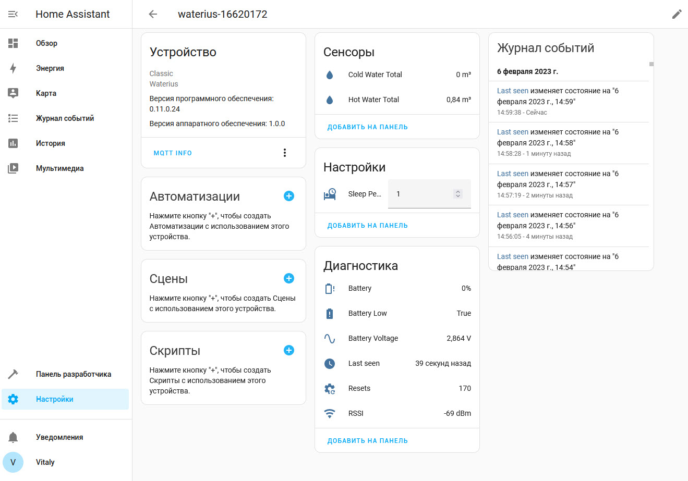
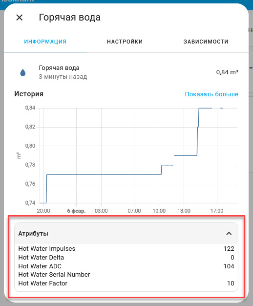
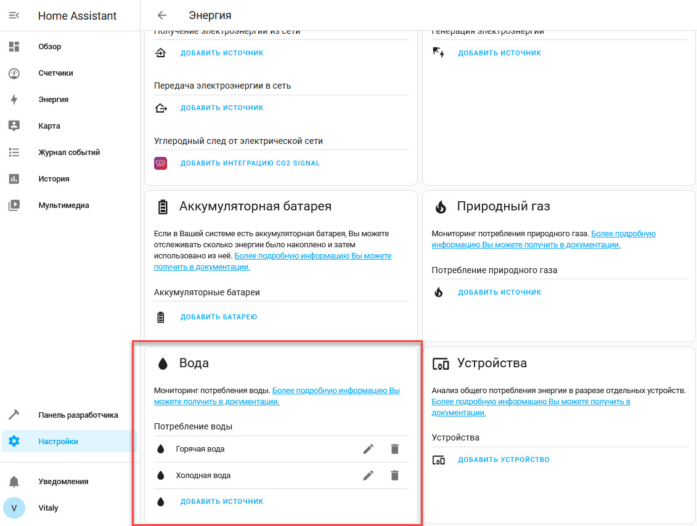
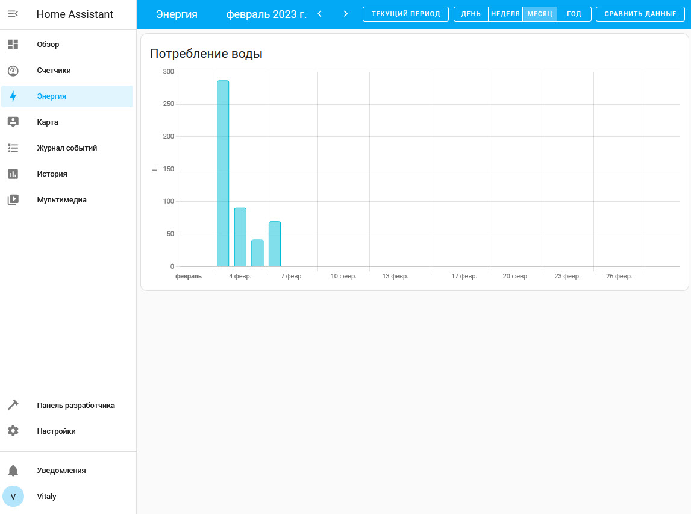
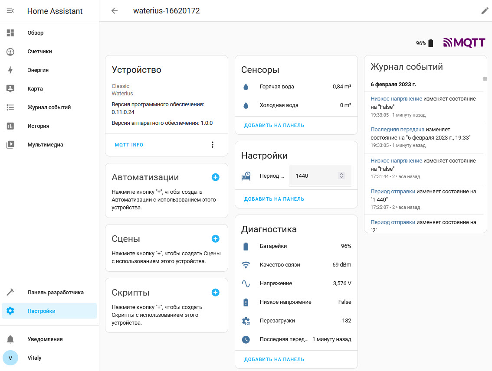

# Настройка интеграции c Home Assistant

Возможна настройка интеграции Ватериуса с Home Assistant в двух режимах:

- [автоматический (с 0.11.0)](#автоматическая-настройка)
- [ручной](#ручная-настройка)

**Важно!** Для обоих режимов необходима настроенная интеграция Home Assistant c [брокером MQTT](https://www.home-assistant.io/integrations/mqtt/).

## Настройки Ватериуса

Для обоих режимов необходимо, чтобы были заполнены следующие настройки в Ватериусе:
1. Указан ip адрес MQTT брокера или имя сайта (192.168.1.5 без http или http://public-broker.ru без номера порта)
2. Указан port MQTT брокера
3. Указан топик, по которому будут отправлены данные (Topic). Топик должен быть уникальным.

Эти настройки отображаются при выделенном чекбоксе "доп. настройки".


## Автоматическая настройка

Для включения автоматической настройки интеграции с Home Assistant при настройке ватериуса отметьте пункт "АВтоматическое добавление в Home Assistant"



После завершения настройки и отправки первых показаний в интерфейсе Home Assistant появится новое устройство.



Для сенсоров показаний (холодная, горячая) и RSSI доступны дополнительные атрибуты, которые можно увидеть щелкнув на выбранный сенсор



Среди атрибутов сенсора показаний едут импульсы, дельта, уровень АЦП входа (`ADC`), серийный
номер, вес импульса, тип ресурса и тип входа — отдельных сущностей для них не создаётся.

#### Что появится помимо показаний

Вместе с показаниями автообнаружение создаёт сущности [тревог](Alarms.md) — это
экспериментальная функция:

| Сущность | Тип | Что это |
|---|---|---|
| `Alarm: high flow` | `binary_sensor`, класс `problem` | много воды сразу |
| `Alarm: continuous flow` | `binary_sensor`, класс `problem` | протечка: расход не падал до нуля |
| `Alarm: consumption stopped` | `binary_sensor`, класс `problem` | расхода не было слишком долго |
| `Alarm: water sensor` | `binary_sensor`, класс **`moisture`** | сработал датчик протечки на полу |
| `Alarm volume per 30 min` (`av`), `Alarm zero flow rate` (`ar`), `Alarm leak hours` (`ah`), `Alarm stop hours` (`as`) | `number` | пороги, ноль выключает тревогу |
| `Clear alarms` | `button` | снять все тревоги (шлёт `63` в топик `arst/set`) |
| `Away mode` | `switch` | режим «Я уехал» |
| `Alarm ack: waterius.ru / own server / MQTT` | `switch` | кто обязан подтвердить доставку тревоги |
| `Input Type` | `select` | тип входа, включая оба датчика протечки |

У входа, занятого датчиком протечки, показаний нет: для него создаются только `Input Type` и
`Alarm: water sensor`. Уровень АЦП такого входа (`adc0`/`adc1`) отдельной сущностью не
публикуется — его видно в самой посылке.

Тревоги по расходу приезжают с прошивкой attiny 41 и новее. На более старой сущности всё
равно создадутся, но всегда будут «в норме»; остановка расхода считается в ЕСП и работает на
любой версии.

После появления устройства и его показателей можно настроить панель "Энергия" для автоматического посчета расходов.

Добавьте в свойствах панели "Энергия" показания расхода воды



После этого отчеты станут доступны в панели.



_Статистика может отражаться не сразу, а по прошествии некотрого времени._

### Перевод названий на русский

Для того чтобы автоматически добавить переводы ко всем показателям можно воспользоваться [настройкой](https://www.home-assistant.io/docs/configuration/customizing-devices/#customizing-entities). Для этого в конфигурационный файл `configuration.yaml` добавьте следующу секцию:

```yaml
homeassistant:
  customize_glob:
    "sensor.waterius_*_ch0":
      friendly_name: "Горячая вода"
    "sensor.waterius_*_ch1":
      friendly_name: "Холодная вода"
    "sensor.waterius_*_voltage_low":
      friendly_name: "Низкое напряжение"
    "sensor.waterius_*_battery":
      friendly_name: "Батарейки"
    "sensor.waterius_*_voltage":
      friendly_name: "Напряжение"
    "sensor.waterius_*_timestamp":
      friendly_name: Последняя передача
    "sensor.waterius_*_resets":
      friendly_name: "Перезагрузки"
    "sensor.waterius_*_rssi":
      friendly_name: "Качество связи"
    "number.waterius_*_period_min":
      friendly_name: "Период отправки"
    "switch.waterius_*_sc":
      friendly_name: "Только при расходе"
    "switch.waterius_*_vac":
      friendly_name: "Я уехал"
    "switch.waterius_*_ackw":
      friendly_name: "Тревога: подтверждение waterius.ru"
    "switch.waterius_*_ackh":
      friendly_name: "Тревога: подтверждение своего сервера"
    "switch.waterius_*_ackm":
      friendly_name: "Тревога: подтверждение MQTT"
    "button.waterius_*_arst":
      friendly_name: "Снять тревоги"
    "binary_sensor.waterius_*_alarm_flow*":
      friendly_name: "Тревога: много воды сразу"
    "binary_sensor.waterius_*_alarm_leak*":
      friendly_name: "Тревога: протечка"
    "binary_sensor.waterius_*_alarm_wet*":
      friendly_name: "Тревога: датчик протечки"
    "binary_sensor.waterius_*_alarm_stop*":
      friendly_name: "Тревога: расход остановился"
    "number.waterius_*_av*":
      friendly_name: "Порог: литров за 30 минут"
    "number.waterius_*_ar*":
      friendly_name: "Порог: нулевой расход, л/ч"
    "number.waterius_*_ah*":
      friendly_name: "Порог: часов протечки"
    "number.waterius_*_as*":
      friendly_name: "Порог: часов без расхода"
```

После перезагрузки Home Assistant свойства устройства будут выглядеть следующим образом



## Ручная настройка

Предполагается, что у вас уже установлен MQTT брокер, а также соответствующая интеграция для Home Assistant.

[Видео инструкция](https://www.youtube.com/watch?v=50J8hMOy7Dc)

### Создание сенсоров

Со списком доступных параметров, а также их описанием можно ознакомиться по [ссылке](https://github.com/dontsovcmc/waterius/blob/master/Export.md)

Также параметры и их текущие значения можно посмотреть при помощи [MQTT Explorer](http://mqtt-explorer.com/)

Ознакомьтесь с примером файла конфигурации [configuration.yaml](homeassistant.configuration.yaml)

Обратите внимание, что название сенсора

```yaml
states.sensor.kholodnaia_voda.last_updated
```

у вас может отличаться, всё зависит от того как вы назвали сенсор слушающий топик расхода холодной воды *ch1*

## Создание автоматизаций

Приведённые ниже автоматизации отправляют уведомления в телеграмм о низком напряжении питания Ватериус, а также в случае если устройство не выходило на связь более 27 часов (100 000 сек)

#### Низкое напряжение на Ватериус

**NB:** Значение сенсора в entity_id может отличаться от указанного в примере, в случае если вы вносили изменения в название сенсоров.

```yaml
- alias: Ватериус низкое напряжение
  trigger:
  - platform: state
    entity_id: sensor.napriazhenie_pitaniia_vateriusa
    to: Низкое напряжение
  action:
  - service: notify.telega
    data:
      message: Внимание! На ватериус зафиксированно низкое напряжение
  mode: single
```

#### Ватериус не выходил на связь более 27 часов

**NB:** Значение сенсора в entity_id может отличаться от указанного в примере, в случае если вы вносили изменения в название сенсоров.

```yaml
- alias: Ватериус вне сети более 27 часов
  trigger:
  - platform: state
    entity_id: sensor.vaterius_last_seen
    to: '100000'
  action:
  - service: notify.telega
    data:
      message: Внимание! Ватериус вне сети более 27 часов.
  mode: single
```
